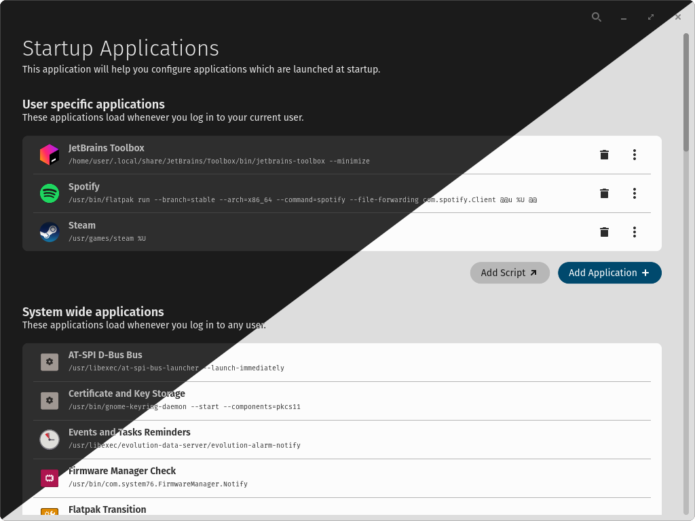

<div align="center">
    
</div>

# Startup Configuration

View, add and remove startup applications on Linux systems.




## Installation

A [justfile](./justfile) is included by default for the [casey/just][just] command runner. To install locally, just run:
```sh
just build-release
sudo just install
```

Other `just` commands:

- `just` builds the application with the default `just build-release` recipe
- `just run` builds and runs the application
- `just install` installs the project into the system
- `just vendor` creates a vendored tarball
- `just build-vendored` compiles with vendored dependencies from that tarball
- `just check` runs clippy on the project to check for linter warnings
- `just check-json` can be used by IDEs that support LSP

## Translators

[Fluent][fluent] is used for localization of the software. Fluent's translation files are found in the [i18n directory](./i18n). New translations may copy the [English (en) localization](./i18n/en) of the project, rename `en` to the desired [ISO 639-1 language code][iso-codes], and then translations can be provided for each [message identifier][fluent-guide]. If no translation is necessary, the message may be omitted.

## Packaging

If packaging for a Linux distribution, vendor dependencies locally with the `vendor` rule, and build with the vendored sources using the `build-vendored` rule. When installing files, use the `rootdir` and `prefix` variables to change installation paths.

```sh
just vendor
just build-vendored
just rootdir=debian/startup-configuration prefix=/usr install
```

It is recommended to build a source tarball with the vendored dependencies, which can typically be done by running `just vendor` on the host system before it enters the build environment.

## Developers

Developers should install [rustup][rustup] and configure their editor to use [rust-analyzer][rust-analyzer]. To improve compilation times, disable LTO in the release profile, install the [mold][mold] linker, and configure [sccache][sccache] for use with Rust. The [mold][mold] linker will only improve link times if LTO is disabled.

## License
This project is licensed under the GPLv3 - see [LICENSE](LICENSE) for the full license.

## Credits

Some code relating to popovers & startup applications were taken from [COSMIC Settings](https://github.com/pop-os/cosmic-settings) (GPLv3).

Icon is a modified version of the [COSMIC Files](https://github.com/pop-os/cosmic-files) icon (GPLv3) and the rocket from [Font Awesome Free](https://fontawesome.com/icons/rocket?f=classic&s=solid) (CC-BY 4.0).

[fluent]: https://projectfluent.org/
[fluent-guide]: https://projectfluent.org/fluent/guide/hello.html
[iso-codes]: https://en.wikipedia.org/wiki/List_of_ISO_639-1_codes
[just]: https://github.com/casey/just
[rustup]: https://rustup.rs/
[rust-analyzer]: https://rust-analyzer.github.io/
[mold]: https://github.com/rui314/mold
[sccache]: https://github.com/mozilla/sccache